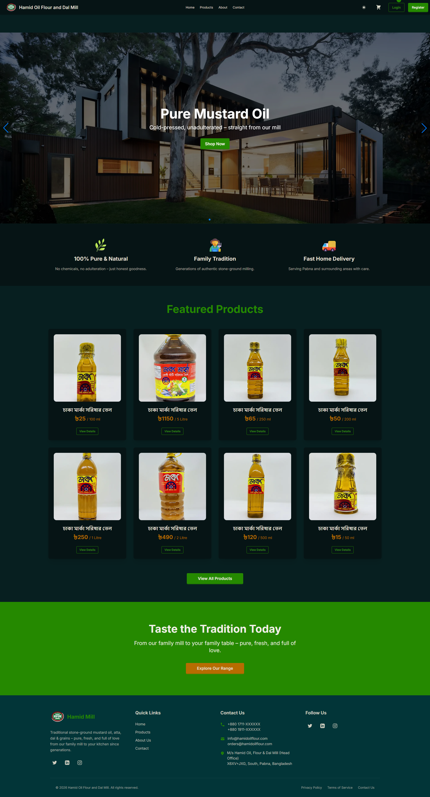
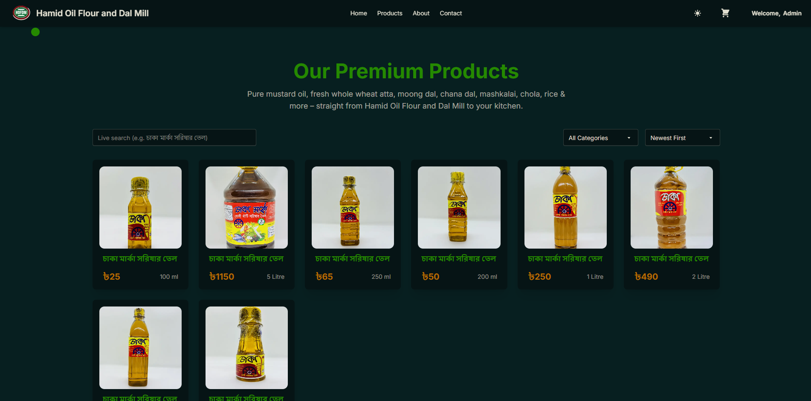
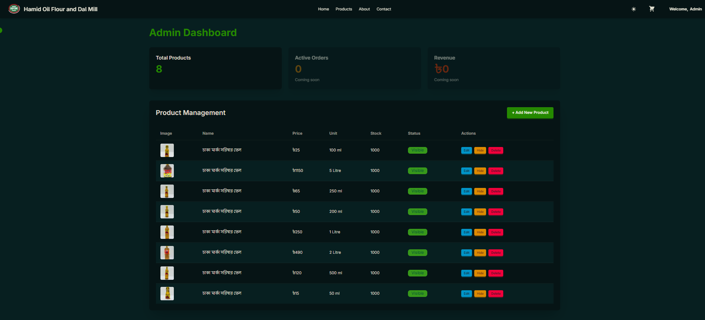

# Hamid Oil Flour and Dal Mill – Online Shop



Modern e-commerce website for **Hamid Oil Flour and Dal Mill** selling pure mustard oil, whole wheat atta, various dals, and grains.

Built with **Next.js 14/15 (App Router)**, **TypeScript**, **Tailwind CSS 4**, **DaisyUI**, **MongoDB**, **JWT authentication**, and more.

## Features

- 🛒 Full product listing with live search, category filter & sorting
- 🖼️ Product detail modal with description & quantity selector
- 🛍️ Add to cart (localStorage – guest + logged-in support planned)
- 🔐 JWT-based authentication (login/register)
- 🛡️ Admin dashboard (add/edit/hide products)
- 🌙 Dark/light theme support (DaisyUI)
- 📱 Fully responsive (mobile-first design)
- ⚡ Fast & SEO-friendly (Next.js + ISR)

## Tech Stack

- **Framework**: Next.js 15 (App Router)
- **Language**: TypeScript
- **Styling**: Tailwind CSS 4 + DaisyUI
- **Icons**: react-icons
- **Database**: MongoDB (Mongoose)
- **Authentication**: JWT (JSON Web Tokens)
- **State**: React Context (Cart & Auth)
- **UI Components**: DaisyUI + custom components
- **Image Optimization**: Next/Image

## Screenshots

### Products Page (mobile view – 2 cards per row)
 <!-- replace with real screenshot later -->

### Admin Dashboard
 <!-- add later -->

## Getting Started

### Prerequisites

- Node.js ≥ 18
- MongoDB (local or Atlas)

### Installation

1. Clone the repository

```bash
git clone https://github.com/YOUR_USERNAME/hamid-mill-shop.git
cd hamid-mill-shop
```

2. Install dependencies

```bash
npm install
# or yarn / pnpm install
```

3. Create `.env.local` and fill the values

```env
MONGODB_URI=mongodb://localhost:27017/hamid-mill
JWT_SECRET=your-very-long-random-secret-here
```

4. Run development server

```bash
npm run dev
# or yarn dev / pnpm dev
```

Open [http://localhost:3000](http://localhost:3000)

### Build & Production

```bash
npm run build
npm run start
```

## Project Structure

```
app/
├── components/           ← reusable UI (ProductCard, Navbar, Footer, etc.)
├── context/              ← CartContext, AuthContext
├── models/               ← Mongoose schemas
├── products/             ← products page + ClientFilters
└── layout.tsx            ← root layout with navbar & footer
```

## Admin Access

- Go to `/admin` (currently unprotected – add auth middleware later)
- Add/edit/hide products

## To-do / Planned

- Proper JWT login/register page
- Protected admin route
- Cart persistence for logged-in users
- Checkout page with address selection
- Order history
- Deploy to Vercel

## Contributing

Pull requests are welcome.  
For major changes, please open an issue first to discuss what you would like to change.

## License

MIT License – feel free to use for learning/portfolio.

Made with ❤️ in Bangladesh
```

### Quick next steps for you

1. Create file `README.md` in the root of your repository
2. Copy-paste the content above
3. Replace `YOUR_USERNAME` with your real GitHub username
4. Add real screenshots later (replace placeholder links)
5. Commit & push

```bash
git add README.md
git commit -m "Add detailed README with preview"
git push
```

